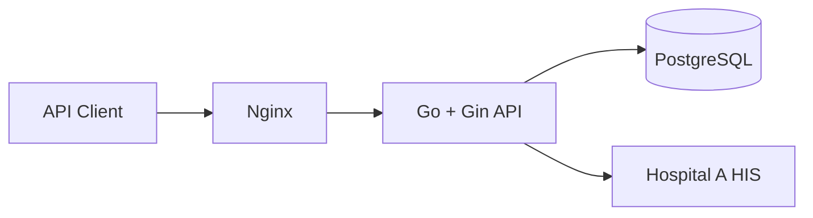

# Development Planning Document

## 1. Objective

Build a hospital middleware API that authenticates hospital staff, retrieves patient information from a hospital HIS, and prevents every staff member from viewing patients outside their own hospital.

## 2. Architecture

Nginx is the public entry point. Gin handles HTTP validation. The service layer owns authentication and hospital-isolation rules. The repository layer uses parameterized PostgreSQL queries. The Hospital Client isolates external HIS communication.

## 3. Request flow

1. Staff registers with a known hospital code.
2. Staff logs in and receives a cryptographically random opaque token.
3. The token is hashed before database storage.
4. Patient search authenticates the token and derives `hospital_id` from the staff record.
5. Identifier search calls the configured hospital HIS, upserts the patient, and searches locally with the authenticated `hospital_id`.
6. The caller cannot submit or override `hospital_id`.

## 4. Testing strategy

- Handler unit tests cover positive and negative scenarios for all three required APIs.
- The Hospital A mock provides deterministic local integration behavior.
- Seed data includes Hospital B to demonstrate tenant separation.
- Run `docker compose run --rm test` for coverage.

## 5. Assumptions

- `hospital` in the request is a stable hospital code such as `hospital-a`.
- At least one patient search field is required to prevent accidental full-hospital exports.
- Search returns no more than 100 records.
- Staff creation is public only because the assignment explicitly requests it; production should require an administrator.

## 6. Production follow-ups

Add TLS, secret management, audit logging, token revocation, observability, retry/circuit-breaker behavior for HIS calls, administrator authorization, database migrations tooling, and CI security scanning.

