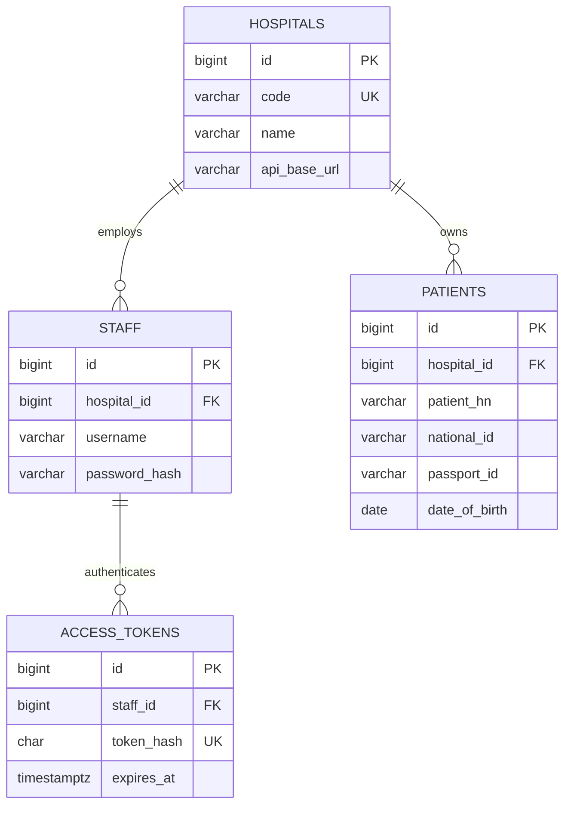

# ER Diagram

```mermaid
erDiagram
  HOSPITALS ||--o{ STAFF : employs
  HOSPITALS ||--o{ PATIENTS : owns
  STAFF ||--o{ ACCESS_TOKENS : authenticates
  HOSPITALS {
    bigint id PK
    varchar code UK
    varchar name
    varchar api_base_url
  }
  STAFF {
    bigint id PK
    bigint hospital_id FK
    varchar username
    varchar password_hash
  }
  ACCESS_TOKENS {
    bigint id PK
    bigint staff_id FK
    char token_hash UK
    timestamptz expires_at
  }
  PATIENTS {
    bigint id PK
    bigint hospital_id FK
    varchar patient_hn
    varchar national_id
    varchar passport_id
    date date_of_birth
  }
```

`hospital_id` is the tenant boundary. HN, national ID, and passport ID are unique per hospital.
